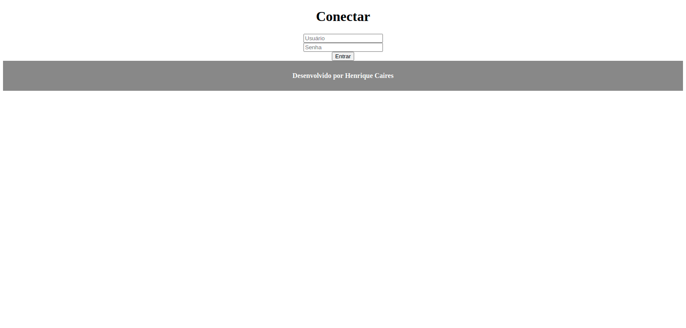

# Desenvolvimento para Internet e Banco de Dados com Python e Django

O projeto consiste na costrução de uma agenda web para multi usuários, utilizando o framework Django.
No primeiro acesso o usuário cria seu login e senha. Após estar logado, poderar inserir, visualizar, editar e remover eventos.
Além do framework foi utilizado conceitos basicos para o desenvolvimento da aplicação, os principais são:
 - [HTML5](https://developer.mozilla.org/pt-BR/docs/Web/Guide/HTML/HTML5)
 - [CSS3](https://developer.mozilla.org/pt-BR/docs/Web/CSS)
 - [sqlite3](https://www.sqlite.org/index.html)
 - [Django admin](https://docs.djangoproject.com/en/3.1/ref/contrib/admin/)

## Agenda em uso

  

# cronograma de desenvolvimento do projeto

## Criando uma página de listagem
 - Configurar tamplates
 - Criar uma página html
 - Listar todos os eventos
 - Listar eventos por usuário

## Autenticação
 - Pacote de autenticação do Django
 - Função authenticate, login, logout, message, login_required
 - Decoradores
 - Implementação login
 - Implementação logout
 
## Inserção de dados
 - Criar página de inserção
 - Criar form para submit da inserção
 - Função create
 
## Alterando e Excluindo dados do banco de dados
 - Criar rotas para edição e exclusão
 - Função delete
 - Função update
 
## Filtrando dados do banco de dados
 - Criar filtros elaborados
 - Alterar HTML conforme deeterminada condicional
 - Configurar Time Zone
 - Exceção através Http404 do pacote http.response
 - Retorno em Json através do JsonResponse do pacote http.response
 

